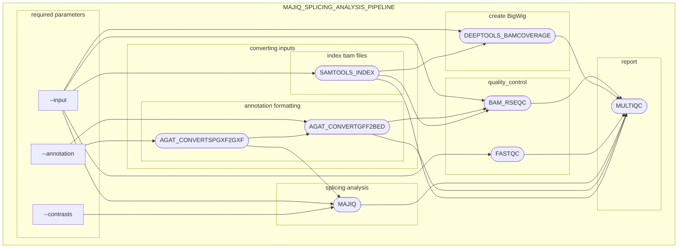

# majiq_splicing_analysis_pipeline

[](https://www.nextflow.io/)
[](https://github.com/ZarnackGroup/majiq_splicing_analysis_pipeline/actions/workflows/linting.yml)
[](https://github.com/nf-core/rnaseq/actions/workflows/nf-test.yml)
[](https://www.nf-test.com)

## Introduction

**ZarnackGroup/majiq_splicing_analysis_pipeline** is our in-house pipeline for analyzing alternative splicing events from RNA sequencing data, based on Nextflow and utilizing [`MAJIQ V3`](https://www.biorxiv.org/content/early/2024/07/04/2024.07.02.601792) as the core splicing analysis tool.



1. **Index BAM files** 
   - [`SAMtools index`](https://doi.org/10.1093/bioinformatics/btp352)  
  
2. **Convert annotation files**  
   - [`AGAT_CONVERTSPGXF2GXF`](https://doi.org/10.5281/zenodo.3552717)  
   - [`AGAT_CONVERTGFF2BED`](https://doi.org/10.5281/zenodo.3552717)

3. **Splicing analysis**
   - [`MAJIQ`](https://www.biorxiv.org/content/early/2024/07/04/2024.07.02.601792)

4. **Coverage track generation**
   - [`deepTools bamCoverage`](https://doi.org/10.1093/nar/gkw257)

5. **Quality control**
   - [`RSeQC`](http://rseqc.sourceforge.net/)  
   - [`FastQC`](https://www.bioinformatics.babraham.ac.uk/projects/fastqc/)

6. **Reporting**
   - [`MultiQC`](https://pubmed.ncbi.nlm.nih.gov/27312411/)

## Usage

> [!NOTE]
> If you are new to Nextflow and nf-core, please refer to [this page](https://nf-co.re/docs/usage/installation) on how to set-up Nextflow. Make sure to [test your setup](https://nf-co.re/docs/usage/introduction#how-to-run-a-pipeline) with `-profile test` before running the workflow on actual data.

### Setting up MAJIQ

1. obtain a LICENSE - MAJIQ is free for Academic use but you need to visit the [homepage](https://majiq.biociphers.org/app_download/)
2. add the license key to your [nextflow secrets](https://nextflow.io/docs/latest/secrets.html) as MAJIQ_LICENSE
   
   ```bash
   nextflow secrets set MAJIQ_LICENSE "$(cat "/PATH/TO/majiq_license_academic_official.lic")"
   ```

3. installing MAJIQ - pick your preferred option, current tests are build for tag 3.0.6
   1. set up with conda: follow the instructions on the download page
   2. set up with docker: you can find a Dockerfile to build a majiq container in the ['assets'](assets/docker/majiq/Dockerfile) folder of this  repository
   3. Apptainer/Singularity -> use the Dockerimage
   4. Others: I have not tried anything else yet if you find a reliable and legal way to set up feel free to contibute here
4. configuring the pipeline to use your majiq installation
     You will need to create a .config file where you point to the container/conda environment for each majiq process. find an example in the `conf` folder - [`cctb.config`](conf/cctb.config). for a conda envrionment you would put "'conda'" instead of "'container'"
     pass the created .config file with the [-c option](https://www.nextflow.io/docs/latest/config.html)

### Running the pipeline

First, prepare a samplesheet with your input data that looks as follows:

`samplesheet.csv`:

```csv
sample,condition,genome_bam
ERR188383,GBR,PATH/TO/ERR188383.Aligned.out.bam
ERR188428,GBR,PATH/TO/ERR188428.Aligned.out.bam
ERR188454,YRI,PATH/TO/ERR188454.Aligned.out.bam
ERR204916,YRI,PATH/TO/ERR204916.Aligned.out.bam

```
Each row represents a bam file. sample is an identifier, should be unique per row. condition is used to group an compare samples. genome bam -> reads need to be aligned against a genome

`contrastsheet.csv`:

```csv
contrast,treatment,control
YRI-GBR,YRI,GBR
```
each row represents a comparison(contrast) the "control" column is used as reference in comparisons, treatment is the column for the other condition. contrast column is an identifier for that comparison

`annotation`:
Annotation file (ideally the one used during alignment). can eb provided in either .gtf or .gff3 format. MAJIQ requires .gff3, if gtf is provided, it will be converted using AGAT

Now, you can run the pipeline using:

<!-- TODO nf-core: update the following command to include all required parameters for a minimal example -->

```bash
nextflow run ZarnackGroup/majiq_splicing_analysis_pipeline \
   -profile <docker/singularity/.../institute> \
   --input samplesheet.csv \
   --contrasts contrastsheet.csv \
   --annotation annotation.gff3 \
   --outdir <OUTDIR> \
   -c majiq.config
```

> [!WARNING]
> Please provide pipeline parameters via the CLI or Nextflow `-params-file` option. Custom config files including those provided by the `-c` Nextflow option can be used to provide any configuration _**except for parameters**_; see [docs](https://nf-co.re/docs/usage/getting_started/configuration#custom-configuration-files).

## Credits

majiq_splicing_analysis_pipeline was originally written by Felix Haidle.

We thank the following people for their extensive assistance in the development of this pipeline:

* be the first!

## Contributions and Support

If you would like to contribute to this pipeline, please see the [contributing guidelines](.github/CONTRIBUTING.md).

## Citations

<!-- TODO nf-core: Add citation for pipeline after first release. Uncomment lines below and update Zenodo doi and badge at the top of this file. -->
<!-- If you use ZarnackGroup/majiq_splicing_analysis_pipeline for your analysis, please cite it using the following doi: [10.5281/zenodo.XXXXXX](https://doi.org/10.5281/zenodo.XXXXXX) -->

<!-- TODO nf-core: Add bibliography of tools and data used in your pipeline -->

An extensive list of references for the tools used by the pipeline can be found in the [`CITATIONS.md`](CITATIONS.md) file.
